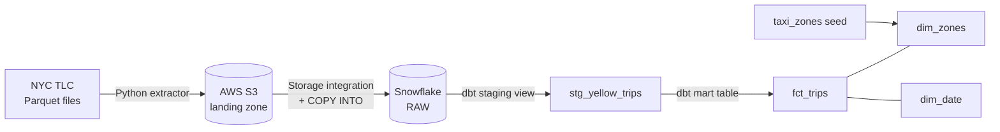
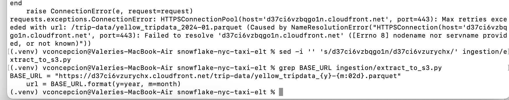

# NYC Taxi ELT Pipeline on Snowflake

An end-to-end ELT pipeline that ingests **9.5M+ NYC yellow taxi trips** (Jan–Mar 2024) from public Parquet files into Snowflake via AWS S3, then models them into a tested **star schema** with dbt.

**Stack:** Python · AWS S3 · IAM · Snowflake · dbt · SQL

## Architecture



### dbt lineage



## Data model

| Model | Type | Grain | Rows |
|---|---|---|---|
| `stg_yellow_trips` | view | one row per raw trip (typed, renamed, de-duplicated) | 9,554,777 |
| `fct_trips` | table | one row per **valid** trip | 9,233,207 |
| `dim_zones` | table | one row per TLC taxi zone | 265 |
| `dim_date` | table | one row per calendar day | 91 |

**16 dbt data tests** cover primary keys (`unique`, `not_null`) and referential integrity (`relationships`) between the fact table and both dimensions. The full pipeline builds and tests in about 30 seconds.

## Data quality

Profiling the staged data (`analyses/data_quality_profile.sql`) surfaced:

| Issue | Trips | Share |
|---|---|---|
| Negative total amount (refunds/voids) | 115,895 | 1.2% |
| Zero trip distance | 215,764 | 2.3% |
| Dropoff not after pickup | 2,801 | 0.03% |
| Pickup outside Jan–Mar 2024 | 21 | ~0% |
| Missing passenger count (kept: trip is still valid) | 751,962 | 7.9% |

In total, **321,570 trips (3.4%)** are excluded from `fct_trips` (categories overlap).

**Bug found through profiling:** at first, *every* trip fell outside the expected date range. Root cause: Parquet timestamps were loaded as raw integers (microseconds since epoch). I fixed the conversion in the staging layer with `to_timestamp_ntz(x, 6)` rather than altering the raw data, then re-profiled to confirm.

## Sample insights

Top pickup zones (`analyses/top_pickup_zones.sql`):

| Zone | Trips | Avg total | Avg tip % of fare |
|---|---|---|---|
| Midtown Center | 442,779 | $24.32 | 21.3% |
| Upper East Side South | 430,533 | $20.14 | 22.4% |
| JFK Airport | 408,780 | $81.91 | 14.3% |
| Times Sq/Theatre District | 320,379 | $27.30 | 20.2% |
| Penn Station/Madison Sq West | 311,907 | $24.59 | 20.7% |

JFK trips cost 3–4× a typical Manhattan trip but show much lower recorded tips, likely because cash tips are not captured in TLC data.

## Engineering highlights

- **Secure cross-account access:** Snowflake storage integration with an IAM role and external ID, so no AWS keys are stored in Snowflake
- **Least privilege:** dedicated `TRANSFORMER` role, read-only role for Snowflake, upload-only IAM user, key-pair-authenticated dbt service user
- **Idempotent ingestion:** the extractor skips files already in S3; `COPY INTO` skips files already loaded
- **Lineage columns:** `_SOURCE_FILE` and `_LOADED_AT` on every raw row
- **Cost controls:** XS warehouse, 60-second auto-suspend, resource monitor

## How to run

1. **Snowflake setup:** run `snowflake/setup/01_setup.sql` through `04_dbt_service_user.sql` in order (fill in your IAM role ARN, bucket and public key).
2. **Python environment:**
   ```bash
   python3 -m venv .venv && source .venv/bin/activate
   pip install -r requirements.txt
   cp .env.example .env   # set S3_BUCKET
   ```
3. **Extract to S3:**
   ```bash
   python ingestion/extract_to_s3.py --year 2024 --months 1 2 3
   ```
4. **Load RAW:** run `snowflake/setup/03_raw_load.sql`.
5. **Transform and test:** configure `~/.dbt/profiles.yml` (key-pair auth), then:
   ```bash
   cd dbt/nyc_taxi
   dbt build
   dbt docs generate && dbt docs serve
   ```

## Repository structure

```
├── ingestion/extract_to_s3.py      # Python extractor: TLC → S3 (idempotent)
├── snowflake/setup/                # Warehouse, roles, storage integration, RAW load, dbt user
├── dbt/nyc_taxi/
│   ├── models/staging/             # stg_yellow_trips + source and tests
│   ├── models/marts/               # fct_trips, dim_zones, dim_date + tests
│   ├── seeds/taxi_zones.csv        # TLC zone lookup
│   └── analyses/                   # data-quality profile, top pickup zones
└── docs/images/                    # lineage graph
```

## Next steps

- Orchestrate with Airflow or Dagster on a monthly schedule
- Run `dbt build` in CI with GitHub Actions on every pull request
- Convert `fct_trips` to an incremental model as more months are added
